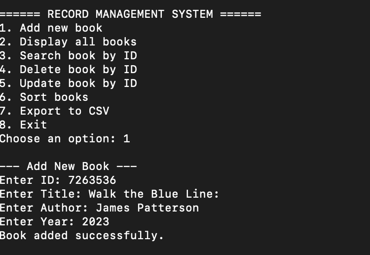
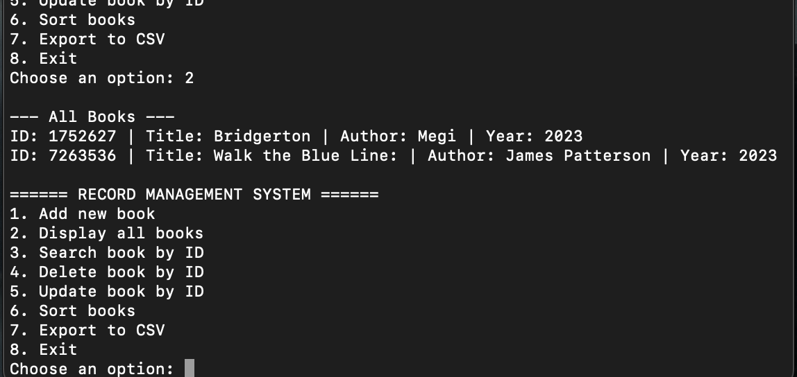
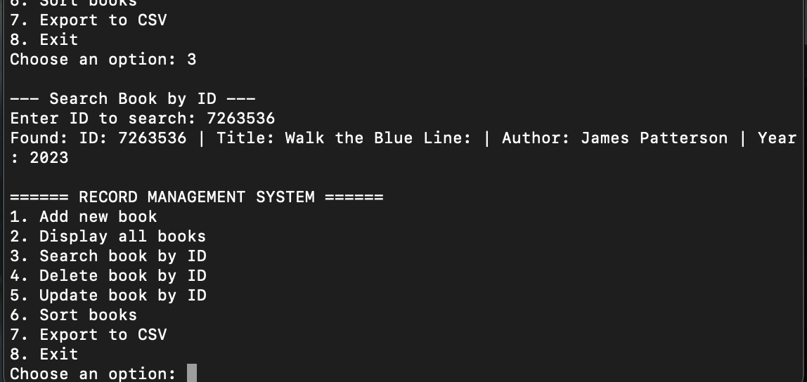

# Record Management System (C++ / OOP)

A simple **file-based** Record Management System for books, written in modern **C++17** with an **Object-Oriented** design.  
Features include **add/search/update/delete**, **sorting**, **CSV export**, and basic error handling.  
Designed to build easily on macOS using **CMake** or **VS Code**.

---

## Features

- Add a new book (unique ID check)
- Display all books
- Search by ID (handles not-found case)
- Update book fields in place
- Delete by ID
- Sort by title or year
- Export all records to a CSV file
- Simple error handling & input validation
- Clean OOP architecture with swappable storage backend

---

## Tech Stack

- **Language:** C++17  
- **Build system:** CMake (or VS Code tasks)  
- **Compiler:** AppleClang / Clang++ on macOS (works on other platforms too)  
- **Storage:** Binary file I/O (records.dat), plus CSV export

---

## Project Structure

RecordManagementSystem/
├─ src/
│ ├─ main.cpp
│ ├─ Book.h / Book.cpp
│ ├─ IStorage.h
│ ├─ FileStorage.h / FileStorage.cpp
│ ├─ RecordManager.h / RecordManager.cpp
│ ├─ Menu.h / Menu.cpp
│ ├─ Utils.h / Utils.cpp
├─ data/ # Created automatically (binary DB file lives here)
│ └─ records.dat
├─ export/ # CSV exports (you choose path at runtime)
│ └─ books_export.csv
├─ screenshots/ # Put your screenshots here
│ ├─ add_book.png
│ ├─ display_books.png
│ └─ search_book.png
├─ CMakeLists.txt
├─ README.md
└─ .gitignore

## Build & Run

### Option 1: Terminal (CMake)

```bash
# From the project root
mkdir -p build
cmake -S . -B build -G "Unix Makefiles"
cmake --build build --config Debug

# Run the program
./build/RecordManagementSystem
``` 
### Option 2: VS Code + CMake Tools
```bash
Install extensions: C/C++ and CMake Tools.

Open the project root (where CMakeLists.txt is).

Command Palette (⌘⇧P) → CMake: Configure (choose Clang).

Command Palette → CMake: Build.

Command Palette → CMake: Run Without Debugging (or use the play button).

```
Make sure your working directory is the project root so the program can find/create data/.

## Usage

When you run the program you’ll see a menu like:
```bash
====== RECORD MANAGEMENT SYSTEM ======
1. Add new book
2. Display all books
3. Search book by ID
4. Delete book by ID
5. Update book by ID
6. Sort books
7. Export to CSV
8. Exit
```
Follow the prompts to manage your records.

Add: Enter ID, title, author, year.

Display: Lists all saved records.

Search: Provide an ID; gets the matching book or “not found”.

Update: Enter ID, then edit any field (press Enter to keep existing value).

Delete: Remove a record by ID.

Sort: Choose title or year.

Export CSV: Provide a path (e.g., export/books_export.csv).
The program will auto-create the folder if it doesn’t exist.

## Screenshots

 ### 1. Add Book


### 2. Display All Books


### 3. Search by ID

